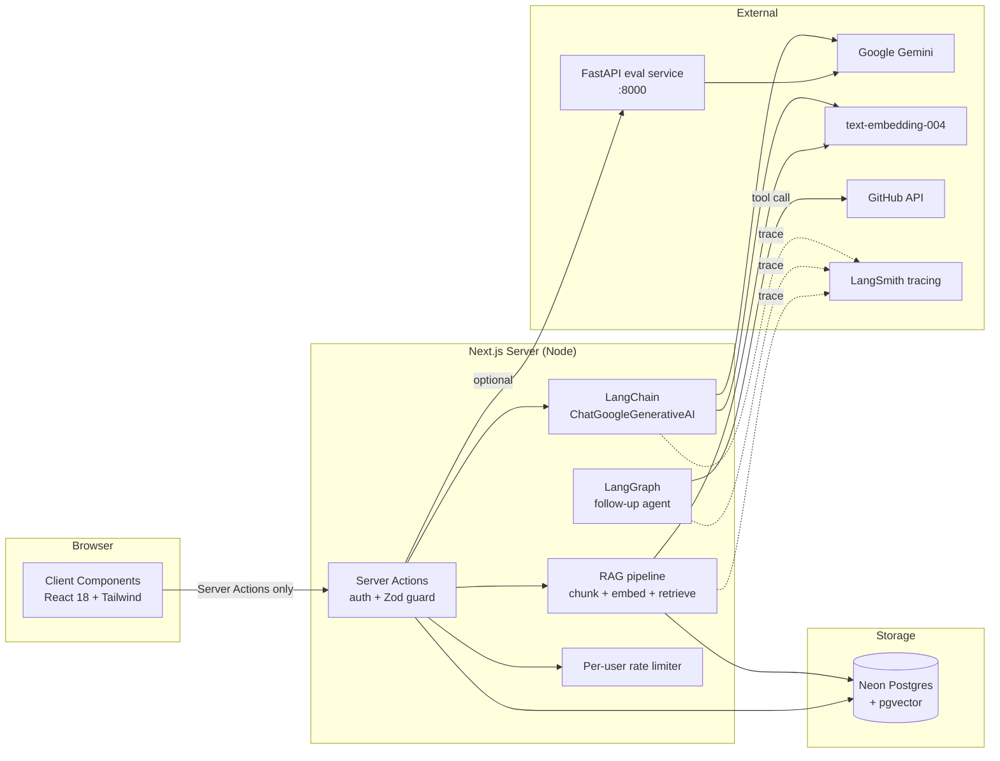

# SkillForge AI — AI Mock Interview Platform

> **LangChain · LangGraph · RAG · Tool calling · Memory · Tracing · Eval**

SkillForge AI is a full-stack web app that runs realistic, AI-driven mock
interviews. A candidate describes a role, the app generates tailored
questions with a large language model, records spoken answers, and returns
structured, per-answer feedback and scoring.

The AI layer is built on **LangChain + LangGraph** (Node) with a
companion **Python + FastAPI** microservice for evaluation. The same
model output is **RAG-grounded** against the candidate's parsed resume,
**tool-augmented** via the agentic follow-up graph, and **traced** to
LangSmith on every call.

---

<p align="center">

[](https://nextjs.org)
[](https://js.langchain.com)
[](https://langchain-ai.github.io/langgraphjs/)
[](https://fastapi.tiangolo.com)
[](https://github.com/pgvector/pgvector)
[](https://smith.langchain.com)
[](LICENSE)
[]()

</p>

## What this project demonstrates

Every claim in the resume maps to code you can read:

| Resume claim | Where it lives |
| --- | --- |
| **LangChain** workflows | `lib/ai/gemini.js` — `ChatGoogleGenerativeAI` + `StructuredOutputParser` (Zod) |
| **LangGraph** agentic flows | `lib/ai/followup-graph.js` — `StateGraph` with tool-calling + transcript memory |
| **RAG** (retrieval-augmented generation) | `lib/ai/rag.js` — chunked resume + `text-embedding-004` + `pgvector` cosine top-K |
| **Embeddings** | `GoogleGenerativeAIEmbeddings` (768-dim) wired into the same LangChain runtime |
| **Prompt engineering** | System prompts in `lib/ai/gemini.js`, `lib/ai/followup-graph.js`, `lib/actions/interviews.js` — same chain, Zod-validated output |
| **Tool / function calling** | `DynamicStructuredTool` wrapping `fetchGitHubProfile` (`lookup_github_profile`), bound to the agent LLM |
| **Context management** | LangGraph state carries role + transcript; Zod schema enforced on every model call |
| **Memory** | Full per-interview transcript persisted in Postgres + replayed into graph state on every follow-up |
| **LLM evaluation** | `npm run eval` (LangChain) and FastAPI `POST /v1/eval` — schema conformance, in-band accuracy, stability |
| **Tracing** | Auto-wired LangSmith tracing when `LANGCHAIN_TRACING_V2=true` + `LANGCHAIN_API_KEY` are set |

---

## Screenshots

> Drop real PNGs into `public/screenshots/` to replace these placeholders.

| Landing | Dashboard | Interview | Feedback |
| --- | --- | --- | --- |
|  |  |  |  |

| Analytics | Resume upload | GitHub personalize | Eval report |
| --- | --- | --- | --- |
|  |  |  |  |

---

## Architecture



ASCII version:

```
Browser (Client Components)
   │  calls Server Actions only
   ▼
Server Actions ("use server", server-only)
   │   • Clerk auth() → userId
   │   • Zod validation (input AND AI output)
   ├──────────────┬───────────────┬───────────────┐
   ▼              ▼               ▼               ▼
Drizzle/Neon   Gemini via      LangGraph       FastAPI eval
(Postgres +    LangChain       (tools +        service
pgvector)      (structured     transcript      (optional)
               output)         memory)
   │                                │
   └────────── LangSmith tracing ───┘
            (env-driven, zero code)
```

### Key contracts

- **Server Actions** (`lib/actions/interviews.js`) are the only path to the
  database and the model. Every action resolves the Clerk `userId` and
  scopes every query to it (`where userId = :caller`).
- **AI calls go through LangChain** — `ChatGoogleGenerativeAI` with
  `StructuredOutputParser` (Zod) for typed, validated output. Same
  `Runnable` interface supports `.invoke`, `.stream`, `.batch`.
- **Follow-up loop is a `StateGraph`** that carries the full transcript as
  state, lets the model call `lookup_github_profile` before committing to
  a question, and is bounded by a step cap.
- **RAG** indexes every uploaded resume into `resume_chunk.embedding
  vector(768)` and retrieves only the top-K chunks most relevant to the
  target role.

---

## Features

- **AI-generated interviews** tailored to job role, description, and years
  of experience.
- **Adaptive follow-up questions** — a LangGraph agent that maintains the
  transcript as state, optionally calls tools, and emits a structured
  follow-up question.
- **RAG-grounded interview generation** from the candidate's own resume
  PDF (chunked + embedded into pgvector, retrieved by cosine similarity).
- **GitHub-personalized interviews** that reference the candidate's real
  languages and top repos; the same `fetchGitHubProfile` is exposed as a
  tool the follow-up graph can call.
- **Tool / function calling** via LangChain `DynamicStructuredTool`.
- **Voice answers** via the browser Web Speech API, with webcam preview.
- **Multi-dimensional rubric scoring** — every answer is scored 0–10 on
  _correctness, clarity, depth,_ and _communication_ (Zod-validated,
  persisted per dimension, plotted in analytics).
- **Personal dashboard** with interview history, score timeline, per-skill
  averages, and rating distribution (NaN-safe).
- **LLM evaluation harness** — local (LangChain) and remote (FastAPI)
  modes, reporting schema conformance, in-band accuracy, and stability.
- **LangSmith tracing** — every LangChain call (chat, embeddings, graph
  nodes, tool calls) is traced automatically when the env vars are set.
- **Secure by construction** — auth-gated Server Actions, per-user
  ownership, Zod-validated inputs and model output, security headers + CSP,
  per-user rate limiting.

---

## Tech stack

| Area            | Choice                                                            |
| --------------- | ----------------------------------------------------------------- |
| Web framework   | Next.js 14 (App Router), React 18, Tailwind, shadcn/ui            |
| Auth            | Clerk                                                             |
| Database        | Neon serverless Postgres + Drizzle ORM + **pgvector**             |
| AI runtime      | **LangChain** (`ChatGoogleGenerativeAI`, `StructuredOutputParser`)|
| Agent graph     | **LangGraph** (`StateGraph`, tool calling, transcript state)     |
| Embeddings      | Google `text-embedding-004` (768-dim)                             |
| Tracing         | **LangSmith** (env-driven, zero code)                             |
| Eval microservice | **Python 3 + FastAPI** (`python/app.py`) — `uvicorn`, Pydantic, `google-generativeai` |
| Validation      | Zod (+ Pydantic on the Python side) + JSDoc types                 |
| Testing         | Vitest (66 tests), Playwright smoke, FastAPI `/docs` for eval     |
| Tooling         | ESLint, Prettier                                                  |

---

## Getting started

### Prerequisites

- Node.js 18.18+ (or 20+)
- Python 3.10+ (only if you want to run the FastAPI eval service)
- A Neon Postgres database (with the `vector` extension available)
- A Clerk application (publishable + secret keys)
- A Google Gemini API key
- (Optional) A LangSmith API key for tracing

### 1. Install (Node)

```bash
npm install
```

### 2. Install (Python, optional)

```bash
cd python
python -m venv .venv
. .venv/Scripts/Activate.ps1     # or: source .venv/bin/activate
pip install -r requirements.txt
```

### 3. Configure environment

```bash
cp .env.example .env.local
```

Fill in `DATABASE_URL`, `GEMINI_API_KEY`, Clerk keys, and optionally the
LangSmith trio (`LANGCHAIN_TRACING_V2`, `LANGCHAIN_API_KEY`,
`LANGCHAIN_PROJECT`).

> **Security:** `DATABASE_URL`, `GEMINI_API_KEY`, and `LANGCHAIN_API_KEY`
> are **server-only**. Never prefix them with `NEXT_PUBLIC_`.

### 4. Bootstrap pgvector + push schema

```bash
node scripts/ensure-vector.mjs   # CREATE EXTENSION IF NOT EXISTS vector
npm run db:push                   # applies drizzle migrations, incl. 0003_resume_rag.sql
```

### 5. (Optional) Run the eval service

```bash
npm run eval:service              # FastAPI on http://localhost:8000
```

Then point the JS eval at it:

```bash
EVAL_SERVICE_URL=http://localhost:8000 npm run eval
```

### 6. Run the app

```bash
npm run dev
```

Open [http://localhost:3000](http://localhost:3000).

---

## Scripts

| Script                  | Purpose                                                        |
| ----------------------- | -------------------------------------------------------------- |
| `npm run dev`           | Start the dev server                                           |
| `npm run build`         | Production build                                               |
| `npm run start`         | Serve the production build                                     |
| `npm run lint`          | ESLint (`next/core-web-vitals`)                                |
| `npm run test`          | Vitest — 66 tests                                              |
| `npm run eval`          | Run the local LangChain eval harness                           |
| `npm run eval:service`  | Start the FastAPI eval microservice (port 8000)                |
| `npm run rag:embed`     | Bulk-embed a resume into pgvector                              |

---

## Project structure

```
app/                     App Router routes, layouts
  dashboard/             Authenticated area
components/
  layout/                Header / Footer
  ui/                    shadcn/ui primitives
lib/
  actions/interviews.js  Server Actions (the only db/AI entry point)
  ai/gemini.js           LangChain ChatGoogleGenerativeAI + Zod structured output
  ai/followup-graph.js   LangGraph StateGraph for adaptive follow-ups
  ai/rag.js              Chunking + embeddings + pgvector retrieval
  parsing/pdf.js         Server-side PDF text extraction
  integrations/github.js Public GitHub profile fetch (also exposed as a tool)
  validation/interview.js Zod schemas for input AND model output
  ratelimit.js           Per-user rate limiting
python/
  app.py                 FastAPI eval microservice (Pydantic + google-generativeai)
  requirements.txt
utils/
  db.js                  Drizzle/Neon client
  schema.js              Drizzle schema (incl. pgvector ResumeChunk)
drizzle/                 Generated SQL migrations + snapshots
scripts/
  eval.js                LLM evaluation harness (LangChain or HTTP)
  embed-resume.js        Bulk-embed a resume into pgvector
  ensure-vector.mjs      Bootstrap pgvector on Neon
public/screenshots/      README screenshots (drop in PNGs)
test/                    Vitest unit + integration tests
e2e/                     Playwright smoke tests
```

---

## How the AI pieces fit together

### Resume RAG

```
parseResumePdf()         chunks (800 chars, 120 overlap)
     │
     ▼
GoogleGenerativeAIEmbeddings  →  resume_chunk.embedding vector(768)
     │
     ▼
createInterviewFromResume() retrieves top-K by cosine similarity
     │                        (<=>) for the target role
     ▼
LangChain ChatGoogleGenerativeAI  →  Zod-validated question set
```

### Follow-up agent (LangGraph)

```
START → agent ──► finalize → END
           │            ▲
           ▼            │
         tools ───────┘
           │
      lookup_github_profile
       (DynamicStructuredTool)
```

The graph carries `{ jobPosition, history, latestQuestion, latestAnswer,
messages, finalQuestion, steps }` as state. The agent node runs once per
turn; if it requests a tool call, we route to `tools` and loop back. A
`force_finalize` node guards against runaway loops with `MAX_STEPS = 4`.

---

## Security

- Server-only secrets; never `NEXT_PUBLIC_`.
- Security headers (CSP, `X-Frame-Options`, `X-Content-Type-Options`,
  `Referrer-Policy`, `Permissions-Policy`, HSTS) in `next.config.mjs`.
- All data access authenticated and ownership-scoped.

---

## Roadmap

**Shipped:** multi-dimensional rubric scoring, LangGraph adaptive follow-up
with tool calling + transcript memory, RAG over resumes with pgvector,
LangSmith tracing, LangChain + Zod pipeline, FastAPI eval microservice.

**Next up:** token-by-token streaming (Vercel AI SDK), per-skill analytics
dashboard, coding-interview mode, production infrastructure (Sentry,
Upstash, Clerk webhooks, Docker).

## License

[MIT](LICENSE) © Vikas Gowda