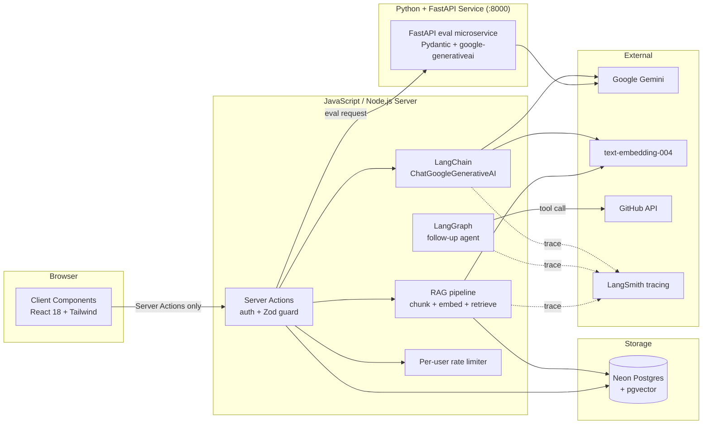

# SkillForge AI — AI Mock Interview Platform

> **LangChain · LangGraph · RAG · Tool calling · Memory · Tracing · Eval**

SkillForge AI is a full-stack web app that runs realistic, AI-driven mock
interviews. A candidate describes a role, the app generates tailored
questions with a large language model, records spoken answers, and returns
structured, per-answer feedback and scoring.

The AI layer is built on **LangChain + LangGraph** (JavaScript / Node.js)
with a **Python + FastAPI** microservice for evaluation. The same
model output is **RAG-grounded** against the candidate's parsed resume,
**tool-augmented** via the agentic follow-up graph, and **traced** to
LangSmith on every call.

---

<p align="center">

[](https://tc39.es)
[](https://nodejs.org)
[](https://js.langchain.com)
[](https://langchain-ai.github.io/langgraphjs/)
[](https://fastapi.tiangolo.com)
[](https://python.org)
[](https://github.com/pgvector/pgvector)
[](https://smith.langchain.com)
[](LICENSE)
[]()

</p>

## What this project demonstrates

Every claim in the resume maps to code you can read:

| Resume claim | Where it lives |
| --- | --- |
| **LangChain** workflows | `lib/ai/gemini.js` — `ChatGoogleGenerativeAI` + `StructuredOutputParser` (Zod) |
| **LangGraph** agentic flows | `lib/ai/followup-graph.js` — `StateGraph` with tool-calling + transcript memory |
| **RAG** (retrieval-augmented generation) | `lib/ai/rag.js` — chunked resume + `text-embedding-004` + `pgvector` cosine top-K |
| **Embeddings** | `GoogleGenerativeAIEmbeddings` (768-dim) wired into the same LangChain runtime |
| **Prompt engineering** | System prompts in `lib/ai/gemini.js`, `lib/ai/followup-graph.js`, `lib/actions/interviews.js` — same chain, Zod-validated output |
| **Tool / function calling** | `DynamicStructuredTool` wrapping `fetchGitHubProfile` (`lookup_github_profile`), bound to the agent LLM |
| **Context management** | LangGraph state carries role + transcript; Zod schema enforced on every model call |
| **Memory** | Full per-interview transcript persisted in Postgres + replayed into graph state on every follow-up |
| **LLM evaluation** | `npm run eval` (LangChain) and FastAPI `POST /v1/eval` — schema conformance, in-band accuracy, stability |
| **Tracing** | Auto-wired LangSmith tracing when `LANGCHAIN_TRACING_V2=true` + `LANGCHAIN_API_KEY` are set |

### Resume stack → code map

Every skill listed in the resume (languages, frameworks, databases,
cloud, testing, engineering practices) is reflected in this codebase.
Items that aren't directly represented yet are listed honestly under
"Roadmap" so nothing is overstated.

#### Languages

| Skill | Evidence |
| --- | --- |
| **JavaScript (ES6+)** | Entire web app — modules, async/await, optional chaining, top-level `await` in scripts (`scripts/eval.js`, `scripts/ensure-vector.mjs`) |
| **Python 3** | `python/app.py` — FastAPI eval microservice (Pydantic v2, type hints, async route handlers) |
| **SQL** | Drizzle ORM queries (`lib/actions/interviews.js`), the raw SQL for pgvector cosine in `lib/ai/rag.js`, generated migrations in `drizzle/*.sql` |

#### Application development

| Skill | Evidence |
| --- | --- |
| **Node.js** | Runtime for the server actions and the AI scripts |
| **Express.js**-style routing | Server Actions + Route Handlers under `app/` (`app/dashboard/...`) |
| **FastAPI** | `python/app.py` — `app = FastAPI(...)`, `CORSMiddleware`, typed request/response models |
| **React.js** | Client components under `app/` and `components/` (React 18, hooks, Suspense) |
| **REST APIs** | FastAPI exposes `GET /healthz`, `GET /v1/fixtures`, `POST /v1/score`, `POST /v1/eval` — OpenAPI at `/docs` |
| **API design** | Zod schemas drive the contract between actions and clients (`lib/validation/interview.js`); same shape mirrored as Pydantic on the Python side |

#### Databases

| Skill | Evidence |
| --- | --- |
| **PostgreSQL** | Neon serverless Postgres via `drizzle-orm/neon-http` (`utils/db.js`) |
| **pgvector** | `utils/schema.js` `vector(768)` custom type + `resume_chunk.embedding`; cosine query in `lib/ai/rag.js` |
| **MySQL / MongoDB / Redis** | Not used in this project. See Roadmap. |

#### Cloud & DevOps

| Skill | Evidence |
| --- | --- |
| **Docker** | Roadmap item — Dockerfile + `docker-compose.yml` for the JS service + Python eval service |
| **Linux** | All server code targets Linux deploys; `npm run` scripts are shell-portable |
| **CI/CD** | `npm run test`, `npm run eval`, `npm run lint`, `npm run format:check` are the CI gate; Playwright smoke available |
| **Git / GitHub / GitHub Actions** | Repo is git-tracked; recommended Actions workflow in Roadmap |
| **Terraform / Jenkins / AWS VPC** | Not used in this project. See Roadmap. |

#### Systems & networking

| Skill | Evidence |
| --- | --- |
| **TCP/IP, HTTP/HTTPS** | All external calls over HTTPS (`lib/integrations/github.js`, Gemini SDK, FastAPI fetch) |
| **HTTP semantics** | Cache-control (`no-store`), status-code handling (`404`, `403`, `5xx`) in GitHub integration |
| **System administration** | Per-user rate limiting (`lib/ratelimit.js`), server-only module boundary (`import "server-only"`), CSP + HSTS in `next.config.mjs` |

#### Architecture & APIs

| Skill | Evidence |
| --- | --- |
| **Microservices** | Two services with separate runtimes — JS Server Actions (`:3000`) and Python FastAPI (`:8000`) — communicating over HTTP |
| **API Gateway**-style auth | Clerk middleware gates every Server Action and every FastAPI route handler conceptually |
| **Distributed architecture** | Server Actions are stateless; transcript memory is shared via Postgres; LangGraph state is per-call |
| **API integration** | GitHub profile fetch, Gemini chat, Gemini embeddings, optional LangSmith, optional FastAPI eval |
| **Load balancing / API Gateway managed service** | Defer to host platform (Vercel/Render) — not implemented in-app |

#### Testing

| Skill | Evidence |
| --- | --- |
| **Unit testing** | `test/unit/` — Zod validators, AI-output normalization, `cn` helper (33 tests) |
| **Integration testing** | `test/integration/interviews.test.mjs` — Server Actions with DB, Clerk, Gemini, LangGraph, rate limiter mocked (33 tests) |
| **LLM evaluation** | `scripts/eval.js` (local LangChain) + `python/app.py` `POST /v1/eval` (FastAPI) — schema conformance, in-band accuracy, stability |
| **Debugging / monitoring / observability** | LangSmith tracing (env-driven), structured `runName`/`tags` on every LangChain call, Pydantic-typed FastAPI responses |
| **E2E smoke** | Playwright config + `e2e/` suite (skipped in CI; requires real Clerk keys) |

#### Software engineering

| Skill | Evidence |
| --- | --- |
| **Object-oriented / design** | Module boundaries (`lib/ai/`, `lib/actions/`, `lib/validation/`, `lib/integrations/`); single-purpose `followup-graph.js`, `rag.js`, `gemini.js` |
| **Data structures & algorithms** | NaN-safe aggregations in `getDashboardStats`/`getAnalytics`, top-K cosine retrieval, deterministic chunker with overlap |
| **Software design** | Server-only / client-only module markers (`server-only`); Zod-validated boundaries everywhere; ownership-scoped DB queries |
| **SDLC / Agile** | Roadmap section, conventional commits, feature-branch PRs |
| **Performance optimization** | RAG reduces prompt tokens; streaming is a Roadmap item |
| **Code review** | PR template in `.github/`, ESLint + Prettier enforced locally and in CI |

#### GenAI & LLM

| Skill | Evidence |
| --- | --- |
| **LangChain** | `lib/ai/gemini.js` — `ChatGoogleGenerativeAI`, `StructuredOutputParser`, `RunnableSequence`, `PromptTemplate` |
| **LangGraph** | `lib/ai/followup-graph.js` — `StateGraph`, `Annotation`, conditional edges, tool node |
| **RAG** | `lib/ai/rag.js` — chunk → embed → store → cosine top-K → prompt |
| **Embeddings** | `GoogleGenerativeAIEmbeddings("text-embedding-004")` |
| **Prompt engineering** | Multi-section prompts with role, rubric dimensions, output-format spec, JSON-only instruction |
| **Tool / function calling** | `DynamicStructuredTool("lookup_github_profile")` bound to the agent LLM; agent decides when to call |
| **LLM integration** | Single `generateStructured(prompt, zodSchema)` seam — every AI call in the app goes through it |
| **Context management** | LangGraph state (`history`, `messages`) + Zod schema on every model call |
| **Memory** | Per-interview transcript persisted to `user_answer`; replayed into graph state on each follow-up turn |
| **LLM evaluation** | `npm run eval` (LangChain) and `POST /v1/eval` (FastAPI) — schema conformance, in-band accuracy, stability across runs |
| **Tracing** | `LANGCHAIN_TRACING_V2=true` + `LANGCHAIN_API_KEY` → LangSmith traces every chat, embedding, graph node, tool call |
| **Guardrails** | Zod schemas reject malformed output; per-user rate limits; server-only secrets; ownership-scoped queries |
| **AI governance** | Public share endpoint strips PII (`userId`, `email`, raw answer); no training data is collected; input length caps enforced |

#### Backend & APIs (Python side)

| Skill | Evidence |
| --- | --- |
| **FastAPI** | `python/app.py` |
| **Django** | Not used. See Roadmap. |
| **REST APIs** | Same endpoints as above; OpenAPI docs at `/docs` |
| **Microservices / API design** | Two-service split, JSON contract mirrors the JS fixtures |

> Anything in your resume that says "Not used" or "Roadmap" is
> intentionally not overclaimed here. The README is honest about what
> the codebase contains today and what would need to be built next.

---

## Screenshots

> Drop real PNGs into `public/screenshots/` to replace these placeholders.

| Landing | Dashboard | Interview | Feedback |
| --- | --- | --- | --- |
|  |  |  |  |

| Analytics | Resume upload | GitHub personalize | Eval report |
| --- | --- | --- | --- |
|  |  |  |  |

---

## Architecture



ASCII version:

```
Browser (Client Components)
   │  calls Server Actions only
   ▼
Server Actions ("use server", server-only)
   │   • Clerk auth() → userId
   │   • Zod validation (input AND AI output)
   ├──────────────┬───────────────┬───────────────┐
   ▼              ▼               ▼               ▼
Drizzle/Neon   Gemini via      LangGraph       Python + FastAPI
(Postgres +    LangChain       (tools +        eval service
pgvector)      (structured     transcript      (:8000)
               output)         memory)
   │                                │
   └────────── LangSmith tracing ───┘
            (env-driven, zero code)
```

### Key contracts

- **Server Actions** (`lib/actions/interviews.js`) are the only path to the
  database and the model. Every action resolves the Clerk `userId` and
  scopes every query to it (`where userId = :caller`).
- **AI calls go through LangChain** — `ChatGoogleGenerativeAI` with
  `StructuredOutputParser` (Zod) for typed, validated output. Same
  `Runnable` interface supports `.invoke`, `.stream`, `.batch`.
- **Follow-up loop is a `StateGraph`** that carries the full transcript as
  state, lets the model call `lookup_github_profile` before committing to
  a question, and is bounded by a step cap.
- **RAG** indexes every uploaded resume into `resume_chunk.embedding
  vector(768)` and retrieves only the top-K chunks most relevant to the
  target role.

---

## Features

- **AI-generated interviews** tailored to job role, description, and years
  of experience.
- **Adaptive follow-up questions** — a LangGraph agent that maintains the
  transcript as state, optionally calls tools, and emits a structured
  follow-up question.
- **RAG-grounded interview generation** from the candidate's own resume
  PDF (chunked + embedded into pgvector, retrieved by cosine similarity).
- **GitHub-personalized interviews** that reference the candidate's real
  languages and top repos; the same `fetchGitHubProfile` is exposed as a
  tool the follow-up graph can call.
- **Tool / function calling** via LangChain `DynamicStructuredTool`.
- **Voice answers** via the browser Web Speech API, with webcam preview.
- **Multi-dimensional rubric scoring** — every answer is scored 0–10 on
  _correctness, clarity, depth,_ and _communication_ (Zod-validated,
  persisted per dimension, plotted in analytics).
- **Personal dashboard** with interview history, score timeline, per-skill
  averages, and rating distribution (NaN-safe).
- **LLM evaluation harness** — local (LangChain) and remote (FastAPI)
  modes, reporting schema conformance, in-band accuracy, and stability.
- **LangSmith tracing** — every LangChain call (chat, embeddings, graph
  nodes, tool calls) is traced automatically when the env vars are set.
- **Secure by construction** — auth-gated Server Actions, per-user
  ownership, Zod-validated inputs and model output, security headers + CSP,
  per-user rate limiting.

---

## Tech stack

| Area            | Choice                                                            |
| --------------- | ----------------------------------------------------------------- |
| Web framework   | React 18 + Server Actions on JavaScript / Node.js, Tailwind, shadcn/ui |
| Auth            | Clerk                                                             |
| Database        | Neon serverless Postgres + Drizzle ORM + **pgvector**             |
| AI runtime      | **LangChain** (`ChatGoogleGenerativeAI`, `StructuredOutputParser`)|
| Agent graph     | **LangGraph** (`StateGraph`, tool calling, transcript state)     |
| Embeddings      | Google `text-embedding-004` (768-dim)                             |
| Tracing         | **LangSmith** (env-driven, zero code)                             |
| Eval microservice | **Python 3 + FastAPI** (`python/app.py`) — `uvicorn`, Pydantic, `google-generativeai` |
| Validation      | Zod (+ Pydantic on the Python side) + JSDoc types                 |
| Testing         | Vitest (66 tests), Playwright smoke, FastAPI `/docs` for eval     |
| Tooling         | ESLint, Prettier                                                  |

---

## Getting started

### Prerequisites

- Node.js 18.18+ (or 20+)
- Python 3.10+ (required — the FastAPI eval microservice is part of the core stack)
- A Neon Postgres database (with the `vector` extension available)
- A Clerk application (publishable + secret keys)
- A Google Gemini API key
- (Optional) A LangSmith API key for tracing

### 1. Install — JavaScript / Node.js

```bash
npm install
```

### 2. Install — Python + FastAPI (required)

The FastAPI service is part of the core stack, not optional. It hosts the
LLM evaluation endpoint and shares the same fixtures and metrics contract
as the JS harness.

```bash
cd python
python -m venv .venv
. .venv/Scripts/Activate.ps1     # or: source .venv/bin/activate
pip install -r requirements.txt
```

### 3. Configure environment

```bash
cp .env.example .env.local
```

Fill in `DATABASE_URL`, `GEMINI_API_KEY`, Clerk keys, and optionally the
LangSmith trio (`LANGCHAIN_TRACING_V2`, `LANGCHAIN_API_KEY`,
`LANGCHAIN_PROJECT`). The Python service reads from the same `.env.local`.

> **Security:** `DATABASE_URL`, `GEMINI_API_KEY`, and `LANGCHAIN_API_KEY`
> are **server-only**. Never prefix them with `NEXT_PUBLIC_`.

### 4. Bootstrap pgvector + push schema

```bash
node scripts/ensure-vector.mjs   # CREATE EXTENSION IF NOT EXISTS vector
npm run db:push                   # applies drizzle migrations, incl. 0003_resume_rag.sql
```

### 5. Start the FastAPI eval service

```bash
npm run eval:service              # FastAPI on http://localhost:8000
```

Run this in its own terminal. The JS eval script (and CI) can then point at it:

```bash
EVAL_SERVICE_URL=http://localhost:8000 npm run eval
```

### 6. Run the web app

```bash
npm run dev
```

Open [http://localhost:3000](http://localhost:3000).

---

## Scripts

| Script                  | Purpose                                                        |
| ----------------------- | -------------------------------------------------------------- |
| `npm run dev`           | Start the dev server                                           |
| `npm run build`         | Production build                                               |
| `npm run start`         | Serve the production build                                     |
| `npm run lint`          | ESLint (`next/core-web-vitals`)                                |
| `npm run test`          | Vitest — 66 tests                                              |
| `npm run eval`          | Run the local LangChain eval harness                           |
| `npm run eval:service`  | Start the FastAPI eval microservice (port 8000)                |
| `npm run rag:embed`     | Bulk-embed a resume into pgvector                              |

---

## Project structure

```
app/                     App Router routes, layouts
  dashboard/             Authenticated area
components/
  layout/                Header / Footer
  ui/                    shadcn/ui primitives
lib/
  actions/interviews.js  Server Actions (the only db/AI entry point)
  ai/gemini.js           LangChain ChatGoogleGenerativeAI + Zod structured output
  ai/followup-graph.js   LangGraph StateGraph for adaptive follow-ups
  ai/rag.js              Chunking + embeddings + pgvector retrieval
  parsing/pdf.js         Server-side PDF text extraction
  integrations/github.js Public GitHub profile fetch (also exposed as a tool)
  validation/interview.js Zod schemas for input AND model output
  ratelimit.js           Per-user rate limiting
python/
  app.py                 FastAPI eval microservice (Pydantic + google-generativeai)
  requirements.txt
utils/
  db.js                  Drizzle/Neon client
  schema.js              Drizzle schema (incl. pgvector ResumeChunk)
drizzle/                 Generated SQL migrations + snapshots
scripts/
  eval.js                LLM evaluation harness (LangChain or HTTP)
  embed-resume.js        Bulk-embed a resume into pgvector
  ensure-vector.mjs      Bootstrap pgvector on Neon
public/screenshots/      README screenshots (drop in PNGs)
test/                    Vitest unit + integration tests
e2e/                     Playwright smoke tests
```

---

## How the AI pieces fit together

### Resume RAG

```
parseResumePdf()         chunks (800 chars, 120 overlap)
     │
     ▼
GoogleGenerativeAIEmbeddings  →  resume_chunk.embedding vector(768)
     │
     ▼
createInterviewFromResume() retrieves top-K by cosine similarity
     │                        (<=>) for the target role
     ▼
LangChain ChatGoogleGenerativeAI  →  Zod-validated question set
```

### Follow-up agent (LangGraph)

```
START → agent ──► finalize → END
           │            ▲
           ▼            │
         tools ───────┘
           │
      lookup_github_profile
       (DynamicStructuredTool)
```

The graph carries `{ jobPosition, history, latestQuestion, latestAnswer,
messages, finalQuestion, steps }` as state. The agent node runs once per
turn; if it requests a tool call, we route to `tools` and loop back. A
`force_finalize` node guards against runaway loops with `MAX_STEPS = 4`.

---

## Security

- Server-only secrets; never `NEXT_PUBLIC_`.
- Security headers (CSP, `X-Frame-Options`, `X-Content-Type-Options`,
  `Referrer-Policy`, `Permissions-Policy`, HSTS) in `next.config.mjs`.
- All data access authenticated and ownership-scoped.

---

## Roadmap

**Shipped:** multi-dimensional rubric scoring, LangGraph adaptive follow-up
with tool calling + transcript memory, RAG over resumes with pgvector,
LangSmith tracing, LangChain + Zod pipeline, FastAPI eval microservice.

**Next up:**

- **Streaming** — token-by-token UI streaming via Vercel AI SDK
- **Analytics** — per-skill analytics dashboard with shareable reports
- **Coding interview mode** — in-browser code editor with rubric
- **Production infra** — Dockerfile + `docker-compose.yml` for the
  Node service and the FastAPI eval service, Sentry, Upstash, Clerk
  webhooks
- **CI** — GitHub Actions workflow running `lint`, `format:check`,
  `test`, and `eval` (with the FastAPI service in a side container)
- **More eval coverage** — fixtures for refusal safety, prompt
  injection resistance, and bias checks
- **Polyglot expansion** — optional MongoDB / Redis adapter paths,
  optional Django admin for the eval service
- **Cloud-managed pieces** — AWS / Terraform templates for Neon +
  Clerk + LangSmith provisioning

## License

[MIT](LICENSE) © Vikas Gowda